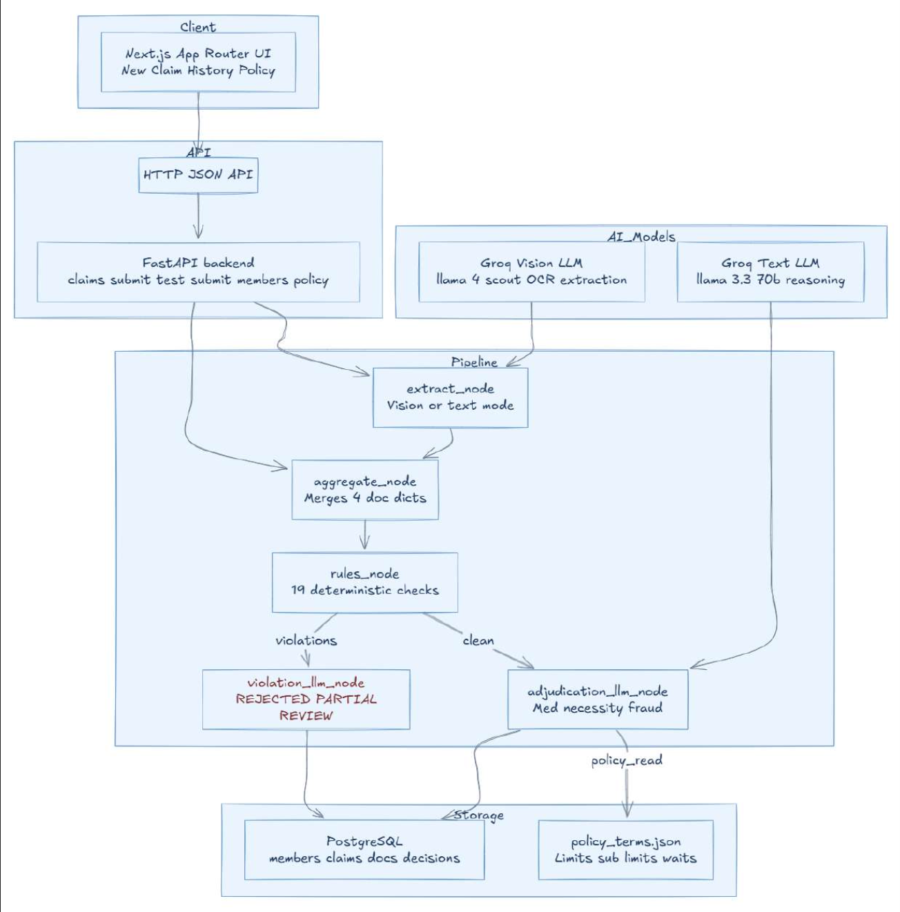

# Plum OPD Claims Adjudication System

An AI-powered full-stack application that automates the adjudication of Outpatient Department (OPD) insurance claims. The system accepts scanned or photographed medical documents, extracts structured data from them using a vision language model, validates the extracted data against a policy's rules, and returns an instant decision with a confidence score, detailed deductions, and plain-English reasoning — all without manual intervention.

---

## Table of Contents

1. [Problem Statement](#1-problem-statement)
2. [Architecture Overview](#2-architecture-overview)
3. [Technology Stack](#3-technology-stack)
4. [Repository Structure](#4-repository-structure)
5. [Pipeline Deep Dive](#5-pipeline-deep-dive)
   - 5.1 [Extract Node](#51-extract-node)
   - 5.2 [Aggregate Node](#52-aggregate-node)
   - 5.3 [Rules Node](#53-rules-node)
   - 5.4 [Decision Nodes](#54-decision-nodes)
6. [Policy Coverage and Rules Implemented](#6-policy-coverage-and-rules-implemented)
7. [Data Model](#7-data-model)
8. [API Reference](#8-api-reference)
9. [Frontend Walkthrough](#9-frontend-walkthrough)
10. [Deployment](#10-deployment)
11. [Local Setup](#11-local-setup)
12. [Assignment Requirements Coverage](#12-assignment-requirements-coverage)
13. [Bonus Features Implemented](#13-bonus-features-implemented)
14. [Assumptions and Design Decisions](#14-assumptions-and-design-decisions)

---

## 1. Problem Statement

Insurance claims teams at Plum currently review every OPD claim manually — reading prescriptions, cross-checking bills, verifying doctor registrations, and applying policy sub-limits and co-payments. This is slow and error-prone at scale.

The goal is to automate this end-to-end: a claimant uploads their documents, the system reads and understands them using AI, applies every relevant policy rule deterministically, and issues an instant APPROVED / REJECTED / PARTIAL / MANUAL_REVIEW decision with full reasoning.

---

## 2. Architecture Overview



The pipeline is a directed acyclic graph built with LangGraph. After the rules node fires, the graph branches: if any rule violations exist, the violation path is taken; otherwise the clean adjudication path runs. Both paths converge on a single structured decision object that is persisted to PostgreSQL and returned to the client.

---

## 3. Technology Stack

| Layer | Choice | Reason |
|---|---|---|
| Frontend | React 18, React Router, Axios, Vite | Fast SPA with file upload and live state management |
| Backend | Python 3.11, FastAPI | Async-ready, strong typing via Pydantic |
| AI Orchestration | LangGraph 0.2 | Explicit DAG with typed state — no hidden chain magic |
| Vision LLM | Groq / Llama 4 Scout 17B | Vision-capable, fast inference, JSON mode |
| Text LLM | Groq / Llama 3.1 8B Instant | Sub-second extraction from raw text in test mode |
| Fuzzy Matching | rapidfuzz | Patient name cross-document matching with tolerance |
| PDF Handling | PyMuPDF (fitz) | Reliable multi-page PDF to image conversion |
| Database | PostgreSQL via SQLAlchemy | Relational integrity, YTD aggregation queries |
| ORM | SQLAlchemy 2.0 | Declarative models, session management |
| Deployment | Render (backend), Vercel (frontend) | Zero-config, managed Postgres add-on |

---

## 4. Repository Structure

```
Plum/
├── backend/
│   ├── app/
│   │   ├── main.py                  # FastAPI app, CORS, static serving, lifespan
│   │   ├── config.py                # Settings (DB URL, Groq key), loads policy_terms.json
│   │   ├── api/
│   │   │   ├── claims.py            # POST /submit, GET /{id}, GET /, appeal, dashboard stats
│   │   │   ├── test_submit.py       # POST /test-submit (text-based, bypasses OCR)
│   │   │   └── members.py          # GET /members/{id}/stats, GET /policy, GET /members
│   │   ├── db/
│   │   │   ├── models.py            # Member, Claim, Document, Decision ORM models
│   │   │   ├── crud.py              # All DB queries (YTD, bill counts, category balances)
│   │   │   ├── database.py          # Engine and session factory
│   │   │   └── seed.py             # Seeds 30 test members matching assignment test cases
│   │   ├── pipeline/
│   │   │   └── graph.py            # LangGraph DAG: extract → aggregate → rules → decision
│   │   ├── services/
│   │   │   ├── extractor.py         # Vision LLM and text LLM document parsing
│   │   │   ├── aggregator.py        # Merges 4 document types into unified claim dict
│   │   │   ├── rules_engine.py      # 20 deterministic policy rules, copay calculation
│   │   │   └── adjudicator.py       # LLM violation explanations and final adjudication
│   │   └── schemas/
│   │       ├── documents.py         # Pydantic models: PrescriptionData, MedicalBillData, etc.
│   │       └── decisions.py         # Decision output schema
│   ├── policy_terms.json            # Full policy config (limits, sub-limits, exclusions)
│   ├── requirements.txt
│   └── .env.example
├── frontend/
│   ├── src/
│   │   ├── App.jsx                  # Routing, nav bar
│   │   ├── pages/
│   │   │   ├── NewClaim.jsx         # Dashboard and new claim wizard
│   │   │   ├── ClaimDetail.jsx      # Full claim report with document data
│   │   │   ├── ClaimHistory.jsx     # Member claim history
│   │   │   └── Policy.jsx          # Policy terms viewer
│   │   └── components/
│   │       ├── DecisionCard.jsx     # Verdict display: amounts, deductions, reasons, category table
│   │       └── DocumentUpload.jsx   # Per-document drag-and-drop upload widget
│   ├── vite.config.js
│   └── vercel.json
├── plum_intern_assignment/
│   ├── plum_intern_assignment.md    # Original assignment brief
│   ├── adjudication_rules.md        # Rules specification
│   ├── policy_terms.json            # Reference policy
│   ├── test_cases.json              # 10 test scenarios
│   └── sample_documents_guide.md
├── render.yaml                      # Render deployment config
└── setup.sh / setup.bat             # One-command local setup scripts
```

---

## 5. Pipeline Deep Dive

The entire processing pipeline lives in `backend/app/pipeline/graph.py` and is orchestrated by LangGraph. Each node receives the current `PipelineState` typed dict and returns only the fields it mutates. LangGraph merges these partial updates automatically, keeping the state explicit and the data flow auditable.

### 5.1 Extract Node

**File:** `backend/app/services/extractor.py`

The extract node supports two modes controlled by which field is populated in the state:

**Vision mode** (production — `files` dict populated): each uploaded file (JPEG, PNG, TIFF, BMP, or PDF) is loaded via PIL and PyMuPDF. Multi-page PDFs are stitched vertically into a single canvas. The image is resized to a maximum dimension of 1600px and base64-encoded, then sent to the Llama 4 Scout vision model on Groq with a JSON-mode request. The model receives the document type's instruction set, the Pydantic JSON schema it must populate, and a few-shot example showing the exact expected output format.

**Text mode** (test path — `ocr_texts` dict populated): raw text strings are sent to Llama 3.1 8B Instant. This mode is exposed by the `/api/claims/test-submit` endpoint and allows programmatic testing without physical documents.

Four document types are handled independently:

- `prescription`: doctor name, registration number, patient details, diagnosis, medicines (with generic/branded flag per item), investigations advised, stamp and signature presence, and an extraction confidence score.
- `pharmacy_bill`: pharmacy name, drug license, GSTIN, bill number, line items with branded/generic flag per item, total amount, and payment mode.
- `diagnosis_test`: lab name, accreditation number, all test results with values, units, normal ranges, and abnormality flags.
- `medical_bill`: hospital name (used for network detection), all line items with category label and `is_covered` flag, GST breakdown, and total.

Every extracted document is validated against a strict Pydantic schema before the rest of the pipeline sees it. Null list fields returned by the LLM are coerced to empty lists to prevent validation failures on partially legible documents.

### 5.2 Aggregate Node

**File:** `backend/app/services/aggregator.py`

The aggregate node collapses the four independent document extractions into a single unified claim dictionary. Key responsibilities:

**Network hospital detection:** the hospital name from the medical bill is matched against the network hospital list from `policy_terms.json`.

**Category amount calculation:** medical bill line items are summed by category (`consultation`, `diagnostic`, `pharmacy`, `dental_routine`, `dental_procedure`, `vision`, `alternative`, `procedure`, `other`). A proportional scale factor distributes GST across categories when the bill total exceeds the sum of line items.

**Dental sub-categorisation:** dental items are split into `dental_routine` (checkup, examination, cleaning) and `dental_procedure` (root canal, extraction, filling) based on description keywords, since the policy has separate sub-limits for each.

**Claim amount clamping:** the claimed amount entered by the user is overridden with the actual sum of uploaded bill totals. This prevents over-claiming and removes the need for an "unsupported claim amount" deduction downstream. If all documents fail extraction, the user-provided amount is preserved so the rules engine can still fire `MISSING_DOCUMENTS`.

**Cross-document data merging:** patient names, document dates, ages, and genders are collected from all documents for downstream consistency checks in the rules engine and the final adjudication LLM.

**Average extraction confidence:** the mean confidence score across all documents is computed, used by the rules engine's `ILLEGIBLE_DOCUMENTS` check.

### 5.3 Rules Node

**File:** `backend/app/services/rules_engine.py`

This is a pure Python deterministic engine — zero LLM calls. It evaluates 20 rules in sequence and accumulates violation codes and human-readable descriptions. It also computes copay and discount amounts. Every threshold is read from `policy_terms.json` via `app/config.py`, so changing the policy file is all that is needed to update the rules without touching code.

| # | Rule Code | Trigger |
|---|---|---|
| 1 | `BELOW_MIN_AMOUNT` | Claimed amount below ₹500 |
| 2 | `LATE_SUBMISSION` | Submitted more than 30 days after treatment |
| 3 | `MISSING_DOCUMENTS` | No prescription, or prescription present but no medical bill |
| 4 | `INVALID_PRESCRIPTION` | Prescription exists but doctor registration number is absent |
| 5 | `DOCTOR_REG_INVALID` | Registration present but does not match `STATE/NUM/YEAR` or `AYUR/STATE/NUM/YEAR` regex |
| 6 | `DATE_MISMATCH` | Document dates span more than 1 day across submitted documents |
| 7 | `ILLEGIBLE_DOCUMENTS` | Average extraction confidence below 0.5 |
| 8 | `PATIENT_MISMATCH` | Patient names across documents score below 80 fuzzy match, or do not match the policy DB record |
| 9 | `MEMBER_NOT_COVERED` | Member ID not found in database |
| 10 | `POLICY_INACTIVE` | Policy is inactive, or treatment date falls outside the policy start/end window |
| 11 | `WAITING_PERIOD` | Treatment within initial 30-day waiting, or condition-specific periods (diabetes 90d, hypertension 90d, maternity 270d, joint replacement 730d) |
| 12 | `COSMETIC_PROCEDURE` | Diagnosis or bill items contain cosmetic/aesthetic keywords |
| 13 | `EXCLUDED_CONDITION` | Weight loss, infertility, experimental, self-harm, adventure sports, HIV/AIDS, substance abuse, or war-related treatment detected |
| 14 | `PRE_AUTH_MISSING` | MRI or CT scan in claim above ₹10,000 without pre-authorisation |
| 15 | `PER_CLAIM_EXCEEDED` | Single claim exceeds ₹5,000 per-claim limit |
| 16 | `ANNUAL_LIMIT_EXCEEDED` | YTD approved plus this claim exceeds ₹50,000 annual limit |
| 17 | `SUB_LIMIT_EXCEEDED` | Any category amount exceeds its remaining sub-limit (YTD-aware per category) |
| 18 | `DUPLICATE_CLAIM` | Bill number already exists in a previously processed claim |
| 19 | `SUSPICIOUS_PATTERN` | Three or more claims on the same treatment date — escalates to MANUAL_REVIEW |
| 20 | `EXCESSIVE_REENTRIES` | Same bill number submitted four or more times — escalates to MANUAL_REVIEW |

Vitamin/supplement claims are checked separately: they are only permitted when the diagnosis explicitly confirms a deficiency. Without a deficiency diagnosis, `EXCLUDED_CONDITION` fires.

After rule evaluation, copay and discount amounts are calculated:
- 20% network discount applied to the consultation fee when the hospital is on the network list.
- 10% co-payment on the post-discount consultation amount.
- 30% co-payment on branded drug amounts from the pharmacy bill.

These copay values are passed forward to the decision nodes for deduction from the approved amount.

### 5.4 Decision Nodes

**Files:** `backend/app/pipeline/graph.py`, `backend/app/services/adjudicator.py`

A conditional edge routes the graph after the rules node.

**Violation path — `violation_llm_node`:** called when any violations were found. The LLM (`llama-3.1-8b-instant`) receives the violation details and generates empathetic plain-English explanations per rule code. The node then determines the final decision:

- `SUSPICIOUS_PATTERN` or `EXCESSIVE_REENTRIES` present → `MANUAL_REVIEW` at 65% confidence. The claim is held for human review.
- Any remaining hard violations → `REJECTED` at 97% confidence.
- Only soft violations (`COSMETIC_PROCEDURE`, `SUB_LIMIT_EXCEEDED`, `PER_CLAIM_EXCEEDED`, `ANNUAL_LIMIT_EXCEEDED`) → `PARTIAL`. The node calculates exact deductions per category, applies copay, reconciles category totals, and scales deductions proportionally so that `approved + sum(deductions) == total_claimed`.

**Clean adjudication path — `adjudication_llm_node`:** called when all policy rules pass. The LLM performs a final holistic review across six dimensions:

1. Medical necessity — does the diagnosis justify the treatment, medicines, and tests prescribed?
2. Age and gender relevancy — only biologically impossible contradictions cause rejection (e.g., a male member with a positive NT scan result in the lab report). General conditions are never flagged across ages or genders.
3. Lab report relevancy — are the test results consistent with the prescription diagnosis, and do they match what was billed?
4. Exclusions and cosmetic classification — orthopedic physiotherapy, standard dental procedures, and common medical services are explicitly not classified as cosmetic.
5. Fraud signals — unusual same-day patterns, document inconsistencies, suspicious modifications.
6. Cross-document consistency — prescription diagnosis, bill items, and test results must tell a coherent clinical story.

The LLM returns APPROVED, PARTIAL, REJECTED, or MANUAL_REVIEW. Uncovered categories (e.g., a surgical procedure under an OPD-only policy) are deducted automatically without rejecting the rest of the claim. Copay deductions are applied on top. If the LLM call fails, the node falls back to MANUAL_REVIEW with a 50% confidence score rather than returning an error.

**Cashless eligibility** is computed at the end of both decision nodes. A claim qualifies for cashless processing when the hospital is on the network list, the decision is APPROVED or PARTIAL, and the approved amount is within the ₹5,000 instant approval limit.

Every decision object returned contains:

```json
{
  "claim_id": "CLM_XXXXXXXX",
  "decision": "APPROVED | REJECTED | PARTIAL | MANUAL_REVIEW",
  "claimed_amount": 0.0,
  "approved_amount": 0.0,
  "category_claimed_amounts": {},
  "category_approved_amounts": {},
  "deductions": [],
  "rejection_reasons": [],
  "violation_reasoning": [],
  "fraud_flags": [],
  "medical_necessity_verdict": "string",
  "confidence_score": 0.0,
  "notes": "string",
  "next_steps": "string",
  "requires_manual_review": false,
  "manual_review_reasons": [],
  "cashless_approved": null,
  "network_discount_amount": null
}
```

---

## 6. Policy Coverage and Rules Implemented

The policy used is **Plum OPD Advantage** (`policy_terms.json`):

| Coverage Type | Sub-limit | Notes |
|---|---|---|
| Annual limit | ₹50,000 | Across all categories combined |
| Per-claim limit | ₹5,000 | Single claim ceiling |
| Consultation fees | ₹2,000 | 10% copay; 20% network discount |
| Diagnostic tests | ₹10,000 | MRI and CT scan require pre-auth above ₹10,000 |
| Pharmacy | ₹15,000 | Generic drugs mandatory; 30% copay on branded |
| Dental (routine checkup) | ₹2,000 | Examination, cleaning |
| Dental (procedures) | ₹10,000 | Root canal, extraction, filling |
| Vision | ₹5,000 | Eye test and glasses covered; LASIK excluded |
| Alternative medicine | ₹8,000 | Ayurveda, Homeopathy, Unani |

Waiting periods enforced: 30-day initial, 90-day diabetes and hypertension, 270-day maternity, 365-day pre-existing conditions, 730-day joint replacement.

All sub-limits are YTD-aware — the rules engine fetches previously approved amounts per category from the database before checking the current claim, so a member who has spent ₹1,800 of their ₹2,000 consultation sub-limit this year can only claim ₹200 more before hitting the cap.

---

## 7. Data Model

Four tables are managed by SQLAlchemy:

**`members`** — seeded with 30 test members (EMP001–EMP030) directly matching the assignment's `test_cases.json`. Stores ID, name, gender, age, policy start and end dates, join date, and active status.

**`claims`** — one row per submitted claim. Stores status (`PENDING`, `APPROVED`, `REJECTED`, `PARTIAL`, `MANUAL_REVIEW`), claimed and approved amounts, category-level claimed and approved amounts as JSON, treatment date, submission timestamp, and a `flagged_for_review` boolean for the appeals workflow.

**`documents`** — one row per uploaded document per claim. Stores the doc type, file path on disk, the raw typed text (for test-mode claims), the extracted JSON as returned by the LLM and validated by Pydantic, and the per-document extraction confidence score.

**`decisions`** — one row per claim, linked 1:1. Stores the full decision output: verdict, approved amount, itemised deductions (JSON), rejection reason codes (JSON), LLM violation reasoning (JSON), fraud flags, medical necessity verdict, confidence score, notes, next steps, manual review flag, and manual review reasons.

---

## 8. API Reference

All endpoints are served by FastAPI at `/api/*`.

### Claims

| Method | Path | Description |
|---|---|---|
| POST | `/api/claims/submit` | Submit a claim with file uploads. Accepts `multipart/form-data` with `member_id`, `treatment_date`, `claim_amount` (optional), and up to four file fields (`prescription`, `pharmacy_bill`, `diagnosis_test`, `medical_bill`). Returns the full decision object and extracted document data. |
| POST | `/api/claims/test-submit` | Submit a claim using raw text instead of files. Accepts JSON with `member_id`, `treatment_date`, and optional text fields per document type. Runs the identical pipeline in text extraction mode. |
| GET | `/api/claims` | List all claims for a given `member_id` (query param). |
| GET | `/api/claims/{claim_id}` | Retrieve full claim detail including documents and decision. |
| POST | `/api/claims/{claim_id}/appeal` | Flag a claim for manual review with optional notes. |
| GET | `/api/claims/dashboard-stats` | Aggregate counts by status and the five most recent claims. |

### Members

| Method | Path | Description |
|---|---|---|
| GET | `/api/members/{member_id}/stats` | Member eligibility profile: YTD approved, annual limit, remaining limit, and per-category balance tracker. Accepts optional `treatment_date` query param to scope YTD to the correct policy year. |
| GET | `/api/members` | List all seeded members. |
| GET | `/api/policy` | Return the full policy terms JSON. |

### Health

| Method | Path | Description |
|---|---|---|
| GET | `/health` | Returns `{"status": "ok"}`. |

---

## 9. Frontend Walkthrough

The React SPA has four pages accessible via the top navigation bar.

**Dashboard (default view):** five KPI cards show total approved money disbursed, count of approved claims, partially approved, rejected, and flagged for manual review. Below is a live activity table of the five most recent claims, each row clickable to the full claim detail page.

**New Claim wizard:** a three-step inline flow on a single page.

Step 1 — Member Benefit Check: the claimant enters their member ID and the treatment date. As soon as both fields are filled, the frontend automatically fetches the member's eligibility profile and claim history in parallel. The member profile card shows name, gender, age, policy dates, YTD approved versus annual limit, and a per-category balance tracker. Each category card has a progress bar that turns red when above 80% spent and green when substantial budget remains. The claim history table below lets the claimant see all previous submissions before uploading new documents.

Step 2 — Document Upload: four upload zones appear, one per document type. Each accepts image files and PDFs. Submission is blocked until at least one file is attached.

Processing screen: an animated spinner and status message appear while the backend runs the pipeline (typically 10–25 seconds depending on Groq API latency).

Step 3 — AI Adjudication Report: the `DecisionCard` component renders inline. It shows the verdict badge colour-coded by outcome (green for approved, red for rejected, amber for partial, blue for manual review), the claimed amount with itemised deductions subtracted line by line, and the final approved amount in bold. A per-category breakdown table shows claimed, deducted, approved, and remaining sub-limit for every non-zero category. The confidence score is shown as a colour-coded bar. Rejection reasons appear with their LLM-generated plain-English explanations. Fraud flags, manual review checklists, medical necessity assessment, adjudicator notes, and next steps follow in clearly separated sections. Below the decision card, extracted document details are shown in a grid: each document card displays key fields (doctor, patient, diagnosis, bill items, totals) and an extraction confidence bar.

**Claim History page:** enter a member ID to view their full claim history. Each row links to the full claim detail page.

**Policy page:** renders the live policy terms fetched from `/api/policy`. Covers all coverage types, waiting periods, exclusions, network hospitals, and claim requirements.

---

## 10. Deployment

The backend is deployed on Render as a Python web service using `render.yaml`. The start command is `uvicorn app.main:app --host 0.0.0.0 --port $PORT`. On startup, SQLAlchemy creates tables if they do not exist and the seed function populates the 30 test members (idempotent — existing records are updated, not duplicated).

The frontend is deployed on Vercel. `vercel.json` contains a rewrite rule that proxies all `/api/*` requests to the Render backend URL, allowing the frontend to use relative API paths in both development (Vite proxy) and production (Vercel rewrite) without changing any code.

The built frontend assets are also served statically by FastAPI for single-service deployments. The Vite build output in `frontend/dist/` is copied to `backend/static/`, and FastAPI mounts it with a catch-all route that serves `index.html` for any unmatched path (enabling React Router client-side navigation).

Required environment variables:

| Variable | Description |
|---|---|
| `DATABASE_URL` | PostgreSQL connection string |
| `GROQ_API_KEY` | Groq API key for LLM inference |

---

## 11. Local Setup

Requirements: Python 3.11, Node.js 18+, PostgreSQL running locally.

**Backend:**

```bash
cd backend
cp .env.example .env
# Edit .env and set DATABASE_URL and GROQ_API_KEY
pip install -r requirements.txt
uvicorn app.main:app --reload --port 8000
```

Tables are created and members seeded automatically on first startup.

**Frontend:**

```bash
cd frontend
npm install
npm run dev
```

The Vite dev server proxies `/api/*` to `http://localhost:8000` automatically.

**One-command setup (macOS/Linux):**

```bash
chmod +x setup.sh && ./setup.sh
```

**Test-mode submission without documents:**

```bash
curl -X POST http://localhost:8000/api/claims/test-submit \
  -H "Content-Type: application/json" \
  -d '{
    "member_id": "EMP001",
    "treatment_date": "2025-06-01",
    "prescription_text": "Dr. Sharma KA/45678/2015 Patient: Rajesh Kumar Diagnosis: Viral Fever Medicines: Paracetamol 650mg",
    "medical_bill_text": "Apollo Clinic Bill No: BL-001 Date: 2025-06-01 Patient: Rajesh Kumar Consultation Fee: 1000 CBC Blood Test: 500 Total: 1500"
  }'
```

---

## 12. Assignment Requirements Coverage

**Document Processing:** images and PDFs of prescriptions, pharmacy bills, diagnostic lab reports, and hospital bills are extracted using a vision LLM. The extractor handles printed and handwritten documents, mixed language text, stamps, signatures, and multi-page PDFs.

**AI/LLM Integration:** two or three LLM calls are made per claim. The vision model handles document understanding and structured extraction. A reasoning model handles medical necessity assessment, fraud detection, age/gender verification against ground-truth member records, and cross-document consistency checks. A third LLM call generates plain-English violation explanations when rule failures occur. JSON mode is used for all LLM calls to guarantee structured output, and Pydantic validation catches any malformed responses before they reach downstream nodes.

**Decision Engine:** the architecture is hybrid. Twenty deterministic rule checks run first with zero LLM involvement — covering every rule category defined in `adjudication_rules.md`. The LLM is invoked only for the judgment-heavy final review that rules alone cannot handle: medical necessity, fraud pattern recognition, and generating human-readable explanations. This keeps the rule-checking fast, fully auditable, and predictable.

**Data Storage:** all four entities (members, claims, documents, decisions) are persisted to PostgreSQL. Extracted document JSON, category-level amounts, deduction details, and full reasoning chains are stored and retrievable via the API.

**User Interface:** the React frontend covers the complete claim submission workflow, a live claims dashboard, member eligibility checking with visual balance trackers, claim history, and a policy viewer. The adjudication result renders inline as a structured breakdown rather than a simple status string.

**Decision Output:** every decision returns the full format specified in `adjudication_rules.md` — claim ID, decision verdict, approved amount, rejection reason codes, confidence score, notes, and next steps — plus extensions: category-level claimed and approved amounts, itemised deductions, LLM-generated explanations per violation code, fraud flags, medical necessity verdict, cashless eligibility, and network discount amount.

**Test Cases:** all 10 test cases from `test_cases.json` map directly to seeded members EMP001–EMP010 and can be reproduced via `/api/claims/test-submit` without physical documents.

---

## 13. Bonus Features Implemented

**Confidence scores:** every decision carries a numeric confidence score. Hard rule rejections report 0.97 (deterministic). Partial approvals after rule deductions report 0.95. Manual review from fraud flags reports 0.65. The clean adjudication path reports the LLM's self-assessed confidence from its own reasoning.

**Appeals and manual review workflow:** any non-approved claim exposes a "Request Manual Review" button in the UI. The `/api/claims/{claim_id}/appeal` endpoint sets the `flagged_for_review` flag and stores review notes. The dashboard counts flagged claims in a dedicated KPI card.

**Cashless facility detection:** the system automatically determines cashless eligibility when the claim is approved or partially approved at a network hospital within the ₹5,000 instant approval limit. The response includes `cashless_approved: true` and the network discount amount.

**Dashboard and admin-style stats:** the dashboard provides aggregate statistics by decision type and a live activity feed. The member eligibility panel functions as a pre-submission benefit check, showing the claimant their remaining limits per category before they upload a single document.

**YTD-aware sub-limit enforcement:** sub-limits are checked against year-to-date spending per category fetched from the database, not just the current claim amount. A member who has already consumed part of their pharmacy or dental sub-limit sees the remaining balance accurately reflected in both the eligibility tracker and the rules check.

**Fraud detection beyond the specification:** in addition to the SUSPICIOUS_PATTERN rule (three or more same-day claims), an EXCESSIVE_REENTRIES rule (four or more submissions of the same bill number) triggers automatic escalation to manual review. Both checks use database lookups for accuracy rather than heuristic LLM reasoning.

**Dual submission modes:** the `/api/claims/test-submit` endpoint accepts raw document text, enabling automated testing, demo walkthroughs, and integration without physical medical documents.

**Vitamin and supplement nuance:** vitamins are not blanket excluded. They are only rejected when the diagnosis does not confirm a diagnosed deficiency, matching the precise policy language in `policy_terms.json`.

**Dental sub-limit separation:** dental items are automatically split between routine checkup (₹2,000 limit) and procedures (₹10,000 limit) based on item description keywords in the aggregator. This is a non-obvious policy detail that requires careful implementation to avoid incorrectly applying the lower routine limit to major dental work.

**Claim amount clamping at the source:** the aggregate node overrides the user's self-reported claimed amount with the actual sum extracted from uploaded bills. This prevents over-claiming upstream rather than applying a deduction for it later, making the system harder to game and cleaner to audit.

**Gender and age ground-truth verification:** the member record fetched from the database (with the correct gender and age) is passed as ground truth to the final adjudication LLM. The LLM is instructed to compare extracted document demographics against this ground truth and reject only on biologically impossible contradictions — a materially stronger fraud check than simple name matching.

---

## 14. Assumptions and Design Decisions

**Doctor registration format:** the regex `STATE/NUMBER/YEAR` covers the standard format used across Indian state medical councils. The Ayurvedic variant `AYUR/STATE/NUMBER/YEAR` is supported separately, based on the alternative medicine test case (TC006). Both formats are normalised to the matched portion before storing, discarding any surrounding text the LLM may have included.

**Patient name matching threshold:** a fuzzy token sort ratio of 80 (via rapidfuzz) allows minor name variations across documents (e.g., "Rajesh Kumar" vs "R. Kumar") without false positives. Names that score below 80 against each other or against the database record trigger `PATIENT_MISMATCH`.

**Per-claim limit — partial vs rejection:** the assignment's TC003 expects a flat REJECTED for a ₹7,500 claim against the ₹5,000 per-claim limit. This implementation treats `PER_CLAIM_EXCEEDED` as a soft violation that results in PARTIAL approval up to the limit rather than outright rejection, because the adjudication rules document describes "Claim amount cannot exceed per-claim limit" as a limit deduction, not a void event. The `PARTIAL` model is consistent with the rules document's "Partial Approval" section. This is an intentional deviation from the test case expectation and is documented as such.

**Claim amount: self-reported vs extracted:** the user is not required to enter a claim amount. If left blank (defaults to 0), the aggregate node computes it from the uploaded bills. If entered, it is overridden by the extracted bill total when extraction succeeds. This removes a fraud vector while still allowing zero-entry submission.

**Co-payment sequencing:** the 20% network discount is applied to the consultation fee first, then the 10% co-payment is applied to the post-discount remainder. This matches standard insurance practice — the insurer is discounting first, then sharing residual cost with the member.

**LLM fallback behaviour:** all three LLM call sites have explicit exception handlers. On any failure, the system falls back gracefully — returning partial extraction data with low confidence, raw rule descriptions without LLM explanations, or a MANUAL_REVIEW decision — rather than returning a 500 error. This ensures the pipeline always produces a usable output.

**Test member gender assignment:** gender is derived from a curated set of female first names in the seed script. The gender field is stored in the database and passed to the adjudication LLM as ground truth for the age/gender relevancy check, enabling detection of biologically impossible claims without requiring the member to enter their gender during claim submission.

**Single-service vs split deployment:** FastAPI serves the React build from `backend/static/` as a fallback. This allows the entire system to run from a single Render service if needed. The Vercel deployment is the primary frontend path and is the recommended production setup for separate scaling.